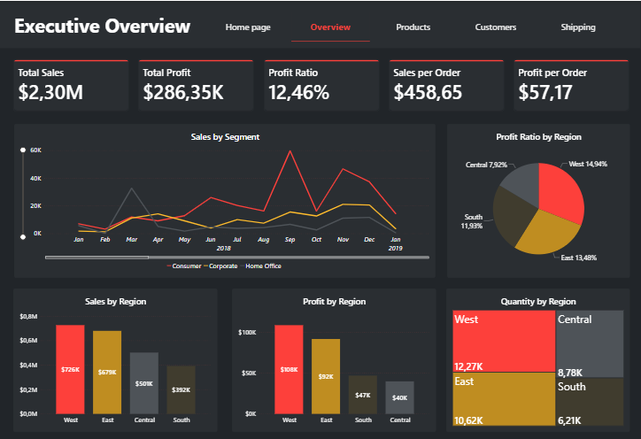

# 📊 Power BI Sales Performance Dashboard

An interactive Power BI dashboard analyzing company sales, profit, customers, and shipping performance across multiple dimensions.

## 🚀 Overview
This dashboard provides a detailed view of business performance through several analytical pages:

### 1️⃣ Executive Overview
- Total Sales: **$2.3M**
- Total Profit: **$286K**
- Profit Ratio: **12.46%**
- Breakdown by **Region** (West, East, Central, South)
- Key metrics: *Sales per Order* and *Profit per Order*

### 2️⃣ Products Page
- Sales and Profit by **Category** and **Product**
- Top-performing categories: *Technology, Furniture, Office Supplies*
- Metrics: **Total Quantity**, **Average Discount (15.62%)**, **Unique Orders (5K)**

### 3️⃣ Customers Page
- **Top Customers by Sales**
- Customer segmentation: *Consumer, Corporate, Home Office*
- Regional distribution of customers and profit contribution
- Key KPIs: *Unique Customers (793)*, *Sales per Customer ($2.9K)*

### 4️⃣ Shipping Analysis
- **On-time vs Late shipments**
- Average delivery days (Scheduled vs Actual)
- Shipping modes: *Standard, Second, First Class, Same Day*
- Regional comparison of shipping performance

## 🧰 Tools Used
- **Power BI Desktop**
- **DAX** for KPI calculations
- **Excel/CSV Dataset** as data source

## 🖼️ Dashboard Preview

## 👩‍💻 Author
**Sabina Ismagulova**  

